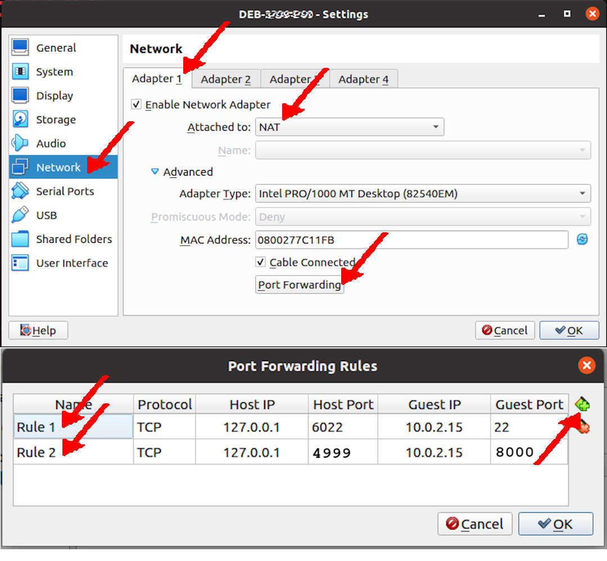
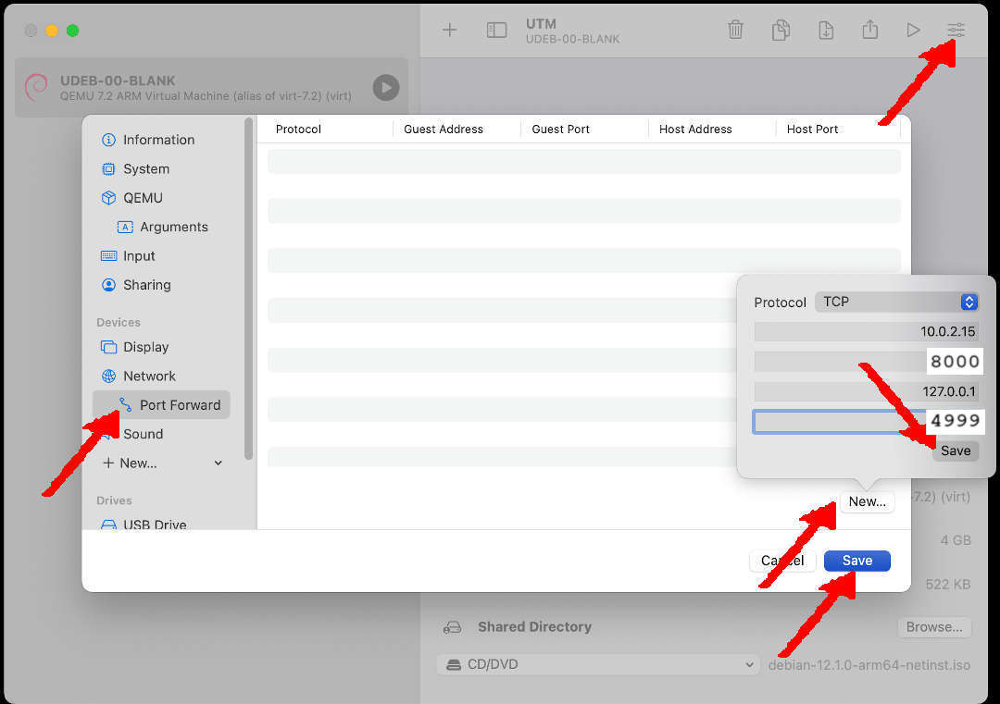

# 251docs by YFORKU!

[&#x213C;](#idxXXX)<br id="idx000">
## Table of Content (Toc)
* [Network Address Translation (NAT) Settings](#idx001)
  * [VirtualBox](#idx001)
  * [UTM](#idx001a)
* [GitHub Repo 251docs](#idx002)
* [Debian Packages](#idx003)
* [CLONE Your GitHub Repo on VirtualBox](#idx004)
* [File .gitignore](#idx005)
* [Check Python, Pip, and Venv](#idx006)
* [Python Virtual Environment](#idx007)
* [Activate the Virtual Environment](#idx008)
* [MkDocs and Plugins](#idx009)
* [MkDocs inside folder "docs/"](#idx010)
* [File: "mkdocs.yml"](#idx11)
* [Test from VirtualBox](#idx012)
* [Build the MkDocs site](#idx013)
* [Switch to gh-pages branch and back to master](#idx014)

[&#x213C;](#)<br id="idx001">
## Network Address Translation (NAT) Settings

### VirtualBox

MkDocs is using local port 8000. 
On your VirtualBox, you must redirect/translate the local port 8000 to the host port 4999.
I am already using 5000 for Jekyll and 5001 for Docusaurus.

* VirtualBox Settings
  * Network:Adapter1:
    * Enable Network Adapter
    * Attached to: NAT
    * Port Forwarding:
      * 127.0.0.1:4999 (Host) --- 10.0.2.15:8000 (Guest)

<br><br>

[&#x213C;](#)<br id="idx001a">

### UTM

MkDocs is using local port 8000. 
On your UTM, you must redirect/translate the local port 8000 to the host port 4999.
I am already using 5000 for Jekyll and 5001 for Docusaurus.

* UTM Settings
  * Network Mode: Emulated VLAN
    * Port Forward: New
      * Protocol: TCP
      * Guest Address: 10.0.2.15
      * Guest Port: 8000
      * Host Address: 127.0.0.1
      * Host Port: 4999
   * SAVE

<br><br>

[&#x213C;](#)<br id="idx002">
## GitHub Repo 251docs

* Create a new [GitHub](https://github.com/) repo.
  * New Repository
  * Repository Name: "251docs"
  * Description: "251docs"
  * Public
  * Add README.md
  * Add .gitignore: Python (temporary)
  * Choose any free LICENSE
  * See also <https://doit.vlsm.org/030.html>
* Create a GitHub page.
  * (Create branch: gh-pages), apparently will automatically create a GitHub Page?!
  * See also <https://doit.vlsm.org/031.html>

[&#x213C;](#)<br id="idx003">
## Debian Packages

Make sure the following Debian packages are present in your system.

```
# USER privilege.
export DEBS="
aptitude
build-essential
git
libffi-dev
libssl-dev
python3
python3-dev
python3-pip
python3-venv
sudo
vim
"
time sudo apt-get install $DEBS -y
date

```

[&#x213C;](#)<br id="idx004">
## CLONE Your GitHub Repo on VirtualBox
* E.g. repo "251docs/"

```
# YOU ARE NOT YFORKU!
GITHUB="yforku"

REPO="251docs"
git clone git@github.com:$GITHUB/$REPO.git
cd $REPO/

```
* REMEMBER: You are not **YFORKU**!
* Write your memo on file "README.md".
  * Update/push "README.md" regularly.

[&#x213C;](#)<br id="idx005">
### File .gitignore

If you still not, go to (cd) repo "251docs/".
Copy the following into your .gitignore file:

```
# REVISI: Fri 29 Nov 2024 16:00
# STARTX: Thu 28 Nov 2024 17:00

# Byte-compiled / optimized / DLL files
__pycache__/
*.py[cod]
*$py.class

# Distribution / packaging
.Python
env/
build/
develop-eggs/
dist/
downloads/
eggs/
.eggs/
lib/
lib64/
node_modules/
parts/
sdist/
var/
package*.json
*.egg-info/
.installed.cfg
*.egg

# PyInstaller
*.manifest
*.spec

# Installer logs
pip-log.txt
pip-delete-this-directory.txt
*.log

# Unit test / coverage reports
# Unit test / coverage reports
htmlcov/
.tox/
.coverage
.coverage.*
.cache
nosetests.xml
coverage.xml
*,cover
.hypothesis/

# Virtualenv
venv/
ENV/

# MkDocs documentation
site*/

# Translations
*.mo

# Scrapy stuff:
.scrapy

# PyBuilder
target/

# IPython Notebook
.ipynb_checkpoints

# pyenv
.python-version

# Miscellaneous
.mkdocs-env/
*.tmp
.DS_Store
*.swp

```


[&#x213C;](#)<br id="idx006">
## Check Python, Pip, and Venv

```
python --version
pip --version
python -m venv --help

```

[&#x213C;](#)<br id="idx007">
## Python Virtual Environment

```
# A centralized ".virtualenvs/" directory
mkdir -pv ~/.virtualenvs/

# Create a Virtual Environment
python3 -m venv ~/.virtualenvs/$(basename $(pwd))

```

[&#x213C;](#)<br id="idx008">
## Activate the Virtual Environment
* Before working with "MkDocs", always activate the virtual environment!

```
source ~/.virtualenvs/$(basename $(pwd))/bin/activate

```

[&#x213C;](#)<br id="idx009">
## Install MkDocs and additional MkDocs plugins

* Upgrade, Clean Up, and Verify Version

```
pip install --upgrade pip mkdocs mkdocs-material
echo "= ======================================="
pip --version
mkdocs --version
pip cache purge

```

[&#x213C;](#)<br id="idx010">
## MkDocs inside folder "docs/"

```
mkdir -pv docs/
cd docs/
mkdocs new .

```

[&#x213C;](#)<br id="idx011">
## File: mkdocs.yml 

```
site_name: 252docs

```


[&#x213C;](#)<br id="idx012">
## Test from VirtualBox

* Check it out at "localhost:4999" (HOST)

```
mkdocs serve --dev-addr=0.0.0.0:8000

```

[&#x213C;](#)<br id="idx013">
## Build the MkDocs site
* Build, commit, and push (master)

```
git add .
git commit -m "Save uncommitted changes"
git push

```

[&#x213C;](#)<br id="idx014">
## Deploy

```
mkdocs gh-deploy --force --clean
git checkout gh-pages
echo "Checkit out at <https://yforku.github.io/251docs/>, but your are not YFORKU!" > README.md
git add .
git commit -m "Include a README.md in gh-pages"
git push origin gh-pages
git checkout master

```

* Checkit out at <https://yforku.github.io/251docs/>, but your are not YFORKU!

<hr>

```
REVISI: Fri 29 Nov 2024 19:01
REVISI: Fri 29 Nov 2024 18:00
REVISI: Fri 29 Nov 2024 17:08
REVISI: Fri 29 Nov 2024 15:00
REVISI: Fri 29 Nov 2024 14:04
STARTX: Tue 26 Nov 2024 12:00
```

